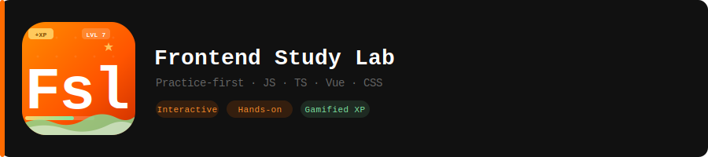

# Frontend Study Lab

[](https://creativecommons.org/licenses/by-nc/4.0/)

A practice-first learning platform for frontend development. Learn JavaScript, TypeScript, CSS, Vue, and more through interactive examples and hands-on coding — not documentation.



## Why This Project?

Most tutorials drown you in theory. This is different. Each topic gives you:

- **Minimal theory** — just enough to understand the concept
- **Interactive demos** — see it working in real time
- **Production-ready code** — patterns you'll actually use
- **Gamification** — earn XP, level up, track progress

## Tech Stack

| Layer        | Tools                                                    |
| ------------ | --------------------------------------------------------- |
| Frontend     | Vue 3 + TypeScript, Vite, Pinia (persisted state)          |
| Backend      | FastAPI, SQLAlchemy (async) + asyncpg, Alembic migrations  |
| Auth         | OAuth2 via Authlib (Google; Twitch/Discord in progress)    |
| i18n         | vue-i18n (EN / RU)                                         |
| Styling      | SCSS (variables, mixins, modules)                          |
| Testing      | Vitest + MSW (frontend unit), Playwright (e2e), Pytest (backend) |
| Code Quality | ESLint (Antfu), Ruff + mypy (backend), Husky + lint-staged |
| CI/CD        | GitHub Actions (`CI`, `Backend CI`), GitHub Pages + Railway deploy |

## Project Structure

```md
frontend-study-lab/
├── backend/ # FastAPI backend
│ ├── app/
│ │ ├── routes/ # auth, progress endpoints
│ │ ├── models/ # SQLAlchemy models (User, UserProgress)
│ │ ├── schemas/ # Pydantic request/response schemas
│ │ ├── services/ # business logic (upsert user, progress)
│ │ ├── utils/ # JWT helpers
│ │ └── config.py # Settings loaded from .env
│ ├── alembic/ # database migrations
│ ├── tests/ # Pytest suite
│ └── Dockerfile # deploy image (Railway)
├── frontend/ # Vue 3 SPA (see below)
├── docs/ # planning docs, AI assistant guide, topic skeleton
├── .github/workflows/ # CI, Backend CI, deploy, bot automation
├── .vscode/ # F5 launch config (db + backend debugger + frontend)
├── docker-compose.yml # local Postgres for backend dev
└── package.json

frontend/
├── api/ # API client layer
│ ├── client.ts # Fetch wrapper with JWT support
│ ├── types.ts # Shared API types
│ ├── progress.ts # Progress endpoints
│ └── auth.ts # Auth endpoints (login redirect, /me, logout)
├── assets/scss/ # Global styles (variables, mixins, demo-page)
├── components/
│ ├── auth/ # AuthButton, AuthModal (OAuth login)
│ ├── layout/ # AppHeader, AppSidebar, AppOverlay, AppFooter, TopicPage
│ ├── profile/ # UserCard, ProgressStats
│ ├── topic/
│   │   └── CompleteButton.vue # "Complete module" button
│   └── ui/
│       ├── UiButton.vue # Reusable button (primary/secondary/ghost)
│       ├── UiCard.vue # Card container with glass effect
│       ├── UiBadge.vue # Difficulty badge (easy/medium/hard)
│       ├── UiProgressBar.vue # XP progress bar
│       ├── UiSpinner.vue # Loading spinner
│       ├── UiModal.vue # Modal dialog
│       ├── UiChip.vue # Chip/tag component
│       ├── ToastContainer.vue # Toast notifications
│       ├── CodeBlock.vue # Code block with language highlighting
│       └── UiIcon.vue # Icon wrapper (Iconify logos)
├── composables/
│   ├── useTopics.ts # Auto-scans topics/ → routes + navigation
│   ├── useAuthGuard.ts # Route guard for authenticated pages
│   └── useToast.ts # Toast notifications
├── helpers/
│   └── useTopics.ts # Pure helper functions (slugify, buildCategory, etc.)
├── i18n/ # Translations (en.json, ru.json)
├── mocks/
│   ├── handlers.ts # MSW handlers for API mocking
│   └── topics.ts # Test mock data (mockTopicItems, mockTopicCategories)
├── pages/
│   ├── HomePage.vue # Dashboard with stats and categories
│   ├── ProfilePage.vue # User profile (avatar, XP, completed modules)
│   └── AuthCallback.vue # OAuth callback handler
├── stores/
│   ├── progress.ts # Pinia store (XP, levels, completed modules)
│   ├── auth.ts # Auth store (user, token, OAuth login/callback)
│   └── ui.ts # UI store (sidebar, theme)
├── topics/ # Learning modules
│   ├── js-core/ # ✅ 7 modules (bind, curry, debounce, etc.)
│   ├── js-dom/ # 🚧 placeholder
│   ├── js-async/ # 🚧 placeholder
│   ├── css/ # 🚧 placeholder
│   ├── scss/ # 🚧 placeholder
│   ├── typescript/ # 🚧 placeholder
│   ├── vue/ # 🚧 placeholder
│   └── nuxt/ # 🚧 placeholder
├── types/ # TypeScript interfaces (topic.ts, meta.ts, progress.ts)
├── tests/ # Vitest unit tests
│   └── useTopics.test.ts # Tests for helpers and composables
├── App.vue # Root layout (header + sidebar + content)
├── main.ts # App entry point
├── router.ts # Dynamic route generation
└── index.html # Entry point
```

## How It Works

### Topic Structure

Each topic is a self-contained module:

```md
frontend/topics/<category>/<module>/
├── \_meta.json # title, difficulty, xp, order, tags
├── <Module>.vue # Interactive demo page
└── <module>.ts # Implementation
```

### Adding a New Topic

1. Create folder: `frontend/topics/<category>/<module>/`
2. Add `_meta.json` with title, difficulty, xp, order
3. Create `<Module>.vue` (interactive demo) and `<module>.ts` (implementation)
4. Done — routing, navigation, and XP are automatic

### Gamification

- Complete modules → earn XP (30/60/100 based on difficulty)
- XP accumulates → level up
- Progress persists in localStorage (backend sync ready)

## Available Categories

| Category         | Icon | Modules | Status     |
| ---------------- | ---- | ------- | ---------- |
| JavaScript Core  | 🟨   | 7       | ✅ Ready   |
| JavaScript DOM   | 🌳   | 0       | 🚧 Planned |
| JavaScript Async | ⚡   | 0       | 🚧 Planned |
| CSS              | 🎨   | 0       | 🚧 Planned |
| SCSS             | 💅   | 0       | 🚧 Planned |
| TypeScript       | 🔷   | 0       | 🚧 Planned |
| Vue 3            | 💚   | 0       | 🚧 Planned |
| Nuxt             | ⛰️   | 0       | 🚧 Planned |

## JavaScript Core Modules

| Module     | Difficulty | XP  | Topics                           |
| ---------- | ---------- | --- | -------------------------------- |
| Bind       | Medium     | 60  | this, context, functions         |
| Curry      | Medium     | 60  | functions, closures, fp          |
| Debounce   | Easy       | 30  | timing, optimization, events     |
| Deep Clone | Medium     | 60  | objects, recursion, immutability |
| Deep Equal | Medium     | 60  | objects, comparison, recursion   |
| Memoize    | Easy       | 30  | cache, optimization, closures    |
| Throttle   | Easy       | 30  | timing, optimization, events     |

## Commands

```bash
pnpm run dev          # Start dev server
pnpm run dev-wait     # Wait for local DB + backend, then start dev server
pnpm run build        # Type check + production build
pnpm run typecheck    # TypeScript check only
pnpm run lint         # ESLint check
pnpm run lint:fix     # ESLint auto-fix
pnpm run test         # Vitest (watch mode)
pnpm run test:run     # Vitest (single run)
```

## Backend

FastAPI + PostgreSQL, source in `backend/`. Local setup:

```bash
docker-compose up -d db                 # Postgres on localhost:5433
cd backend
python3 -m venv .venv && source .venv/bin/activate
pip install -r requirements-dev.txt
alembic upgrade head
uvicorn app.main:app --reload --port 8000
```

Or press **F5** in VS Code — `.vscode/launch.json` runs the whole stack (DB → backend with debugger → frontend) in one go.

```bash
cd backend
pytest -q            # Tests
ruff check app tests scripts   # Lint
mypy                  # Type check
```

## Testing

Tests use Vitest with jsdom environment. Mock data lives in `frontend/mocks/`.

```bash
pnpm run test:run     # Run all tests once
pnpm run test         # Watch mode
pnpm exec vitest run frontend/tests/useTopics.test.ts  # Single file
```

## Development

Want to contribute? See [CONTRIBUTING.md](./CONTRIBUTING.md) for:

- Local setup instructions
- Project structure overview
- Development workflow (branching, commits, PRs)
- Adding new topics (with examples)
- Code style guidelines

Quick start:

```bash
git clone https://github.com/Faustzer/frontend-study-lab.git
cd frontend-study-lab
pnpm install
cp frontend/.env.example frontend/.env
pnpm run dev
```

## Roadmap

- [x] Vue 3 + TypeScript + Vite setup
- [x] Pinia store with persisted state
- [x] vue-i18n (EN/RU)
- [x] API layer (client, types, endpoints)
- [x] MSW API mocking
- [x] Husky + lint-staged
- [x] Dynamic topic routing
- [x] Gamification (XP, levels, progress)
- [x] Unit tests (Vitest) — helpers/useTopics.ts covered
- [x] UI component library (UiButton, UiCard, UiBadge, UiProgressBar, UiSpinner, UiModal, UiChip, CodeBlock, UiIcon)
- [x] Layout components (AppHeader, AppSidebar, AppOverlay)
- [x] Topic components (CompleteButton)
- [x] Code blocks with overflow handling
- [x] Backend (FastAPI + PostgreSQL + Alembic)
- [x] OAuth2 — Google (Twitch, Discord in progress)
- [x] User profiles
- [x] Progress sync (frontend ↔ backend)
- [x] CI/CD (GitHub Actions: `CI`, `Backend CI`, deploy)
- [x] Deploy — GitHub Pages (frontend) + Railway (backend)
- [ ] E2E tests (Playwright) wired into CI
- [ ] Dark mode
- [ ] Nuxt migration (see `docs/MIGRATION.md`)
